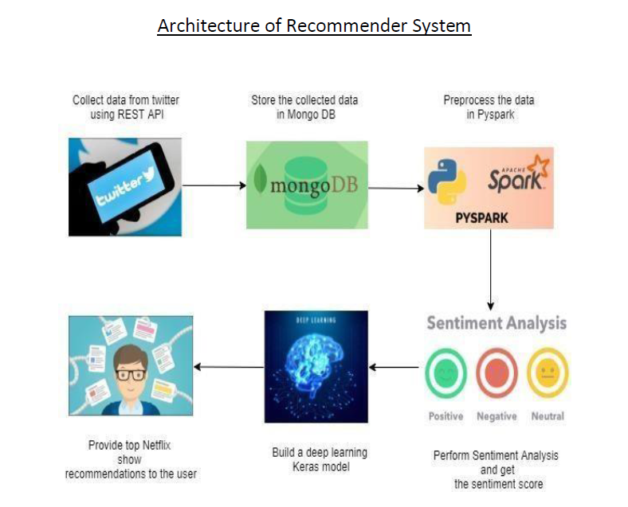
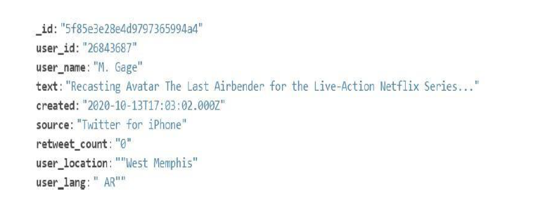
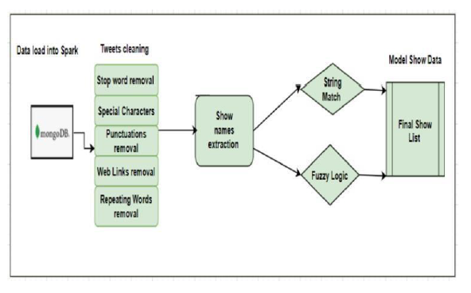
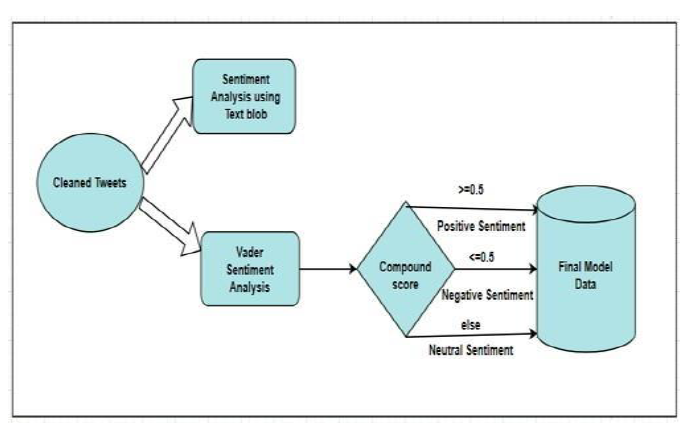
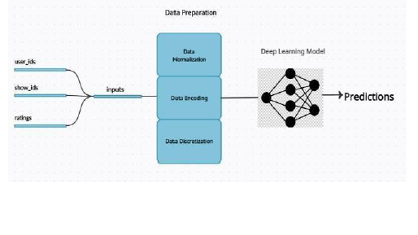
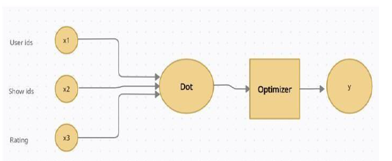

# SOCIAL MEDIA ANALYSIS AND NETFLIX SHOW RECOMMENDATION SYSTEM USING NLP AND DEEP LEARNING
* ABSTRACT

Recommendation systems are one of the most popular intelligent systems which enable users to discover new and relevant products as per their interest. Traditional approaches such as collaborative filtering and content- based recommender systems have gained popularity over the years. In this project, we propose a deep neural network-based user-item collaborative filtering recommendation system of Netflix shows for twitter users. This is built using sentiment analysis of tweets about Netflix shows and movies. Twitter data is collected using REST API in python and NLP techniques are performed to extract show names. The proposed approach is build solely using implicit feedback of the user and thereby its purely based on user’s social media interaction. Deep learning MLP model produced promising results with decent accuracy and low errorrates.

* INTRODUCTION

In today’s world recommendation system have become integral part of our day-to-day life. We will be provided with n number of results if we are searching for anything online. This massive amount of information is a little overwhelming for the users. Recommender systems provide relevant suggestions to users based on their history of searches or by finding similarity with the history of users with the item they are looking for. Hence recommender systems are used largely by retail industries, service providers as well as entertainment industries and help their users to make decisions much faster.
Twitter is one of the largest microblogging and social networking service where registered users interact via tweets, retweets, likes etc. Users express their interest on different topics via tweets and hence they are excellent source to understand people’s opinion, likes and dislikes. Even though the number of twitter users are not as big as many other mainstream applications such as YouTube or WhatsApp, we can get a lot of opinions, mentions and hashtags about topics which provides a clear understanding about the user’s stand. Moreover, the textual data can be analysed and processed to interpret the underlying sentiment and hence emotions can be classified into positive, negative, and neutral. We leveraged this aspect and attempted to build a recommendation system unlike the conventional systems which uses user ratings to understand the user-item interactions.
In this project, we focus mainly on building a Netflix show recommendation system based on twitter user interests about different shows which they expressed through tweets. Deep learning and NLP (Natural Language Processing) have had immense impact on wide variety of services recently and we made use of these machine learning techniques to perform sentiment analysis of tweets and provide recommendations based on sentiment score.

* DATASET

Our project idea is to build a recommendation system based on twitter data. There are several twitter users who express their interest about Netflix shows, post reviews through their tweets. We have analyzed such tweets to extract their interest and build a collaborative recommendation system using NLP and Deep learning model which suggest shows of the user’s interests. To achieve this, we have collected tweets using Twitter API with different search keywords related to Netflix show interests. In our project, the dataset is created from social media data (Twitter) using REST api to collect data. We have used different keywords for each genre and collected directly into MongoDB. The data contains four different collections for each genre (Comedy, Romance, Horror and Action) and around 160000 records in total from each genre of 40000 records. The data comprises of twitter data such as userid, username, text, created, retweet_count, source, user language and user location. We also collected rating records from IMDB using web scraping of each shows extracted from tweets. In addition, we have collected ratings and show list of all current Netflix shows for using exact names of the shows as Twitter has unstructured data. Each user in our data has at least one tweet about a show or movie on Netflix. There is a total of 3365 users in 160000 records. Users who have not tweeted at least a show / movie are removed.

* DATA AND MAPPING SHOW NAMES

We extracted twitter data with a goal of collecting tweets which is related to Netflix shows. To get a sensible data from twitter and collect the Netflix show names from tweets, we used different search keywords such as “best comedy Netflix”, “best action Netflix”, “best thriller Netflix” etc.

The data gathered from the twitter looks like below,

As we did not acquire significant number of tweets with this, we collected tweets by giving show names as keywords as shown below,

Our next step was to clean the tweets and extract show names from them after which we can get the sentiment score for each tweet. To extract titles/shows, we used regex to extract words which are within quotes, starts with Capital letter and hashtags as we could see most tweets had show names mentioned in these formats. Once such words were extracted, for show mapping we used string matching and fuzzy methods. We did a full string matching where we could get an exact match between extracted words and actual show titles (Collected from Kaggle dataset). For words which did not pass an exact match test, we did a partial string-matching using Fuzzy string match. Fuzzy logic outputs a value (Lower the score, higher the match) based on how close two strings are. After trying few threshold values, we set a threshold score of 10 with which we got most similar matches and mapped actual show titles with score < 10 and selected only those extracted titles/shows.

Since we have used two methods for show extraction, we did not exclude any potential good data but fuzzy string matching which is a partial matching method, there are chances that the tweets can be unrelated to the matched names for few cases. We included such data so that we will have adequate amount of data to perform rest of the project and most importantly build a deep learning model.

As far as the subjectivity of the tweets are concerned, after processing the data using NLP, filtering it using Regex and cleaning it, we removed bad data, but we could not eliminate all bad data from our dataset. We had to compromise the subjectivity and include such data since we are predicting sentiment of the user item interaction which is mainly based on user’s reaction towards a certain topic.

One example of the tweets with show title has shown below,

The text column is showing actual tweet on twitter posted by user_id 202480252. Since the text data has Netflix keyword and movie word, we have extracted the show name using Regex and fuzzy logic. In this case we know that the user is talking about the movie ‘Hush’. Here, the user is talking about the movie subject only as we extracted the tweets using keywords such as Netflix or movies.

Another example, a tweet:
"The Witcher is fantastic!"  this tweet could be about the show, the novels, or the games.

Here, we can see that there is no clear subjectivity as the data collected by matching a list of show names. But our project simply considered it as a tweet about the show and sentiment analysis was performed, because our main idea was to build a recommendation system based on sentiment score.
Overall, we tried to build a Netflix show recommender system for twitter users who express their interest about shows through tweets. Since there are above mentioned inconsistencies(partial string matching) involved in the data, as NLP is a vast field, we believe this could be improved by collecting tweets which are more specific about shows. Since Twitter contains many user specific unstructured data, we believe that the veracity of this time series data extracted from tweets can be further analyzed to get better accuracy which we considered as future scope.

* Proposed Approach

In this project, the applied techniques for building the recommendation system using social media has the below five approaches,
 Problem Statement: In this project, we have analyzed and identified a common problem that we see for any ecommerce website. Most of the recommendation system is based on user’s implicit feedback i.e. ratings, comments, and view details. But social media platforms are becoming very popular nowadays and helping ecommerce domains to know customer behavior and their taste in order to sell products or to suggest items. We have chosen social media (Twitter) analysis for our project to build a Netflix recommendation system.
This recommender system uses social media data to recommend movies or shows on Netflix which is based on user’s sentiment. Based on our analysis with social media user data, we further characterize the problem and establish the requirement of the Netflix recommender system. Finally, our goal is to recommend movie or shows on Netflix based on Twitter user data and it’s interaction with Netflix items (shows/movie) through tweets.

Data Gathering: In this step, we check the design of recommendation system then produce prototype for the recommendation system and gather data based on our requirement. From the previous step, we can tell that our project is based on social media data (text data only), so we have chosen Twitter platform as it is very popular and has various user data with variety of real-time data. We have written a python code using tweepy module which helps to connect to the twitter services. We have used Rest API for data collection. The total data collected is around 160k (40k for each genre). Our python code is making a connection to Twitter API and loading the data directly into MongoDB. The output is a top level json array which consists of the below variables. We have categorized the data into 4 genres (action, horror, comedy, and romance).
Example of json array variable names in the MongoDB document,

Preprocessing: In our proposed approach, we have used text data from twitter. Since text data is unstructured, we have cleaned the data and removed all uninformative data from thedataset.

This is the diagram of our preprocessing method. We have cleaned the tweets by removing stop words, special characters, punctuations, web links and repeating words. These are typically the noise in the text data which we do not require in our data analysis. After cleaning the data, we extracted the Netflix show names from tweets. To match the tweeted Movie or show names with the actual Netflix show names, we have applied two methods a. String Matching, b. Levenshtein Fuzzy Logic.
String matching is a simple matching of two strings and taking all matched show names into a dataframe. Levenshtein fuzzy logic is a similarity matching method which compares two words based on the distance between them. Levenshtein distance is measured by the minimum number of edits required to change one string into the other one to match both the strings. After matching using both the logic, we have used that original show and movie lists as our model input data for the proposed recommendation system.

Sentiment Analysis: After preprocessing the data, we have done sentiment analysis of the tweets. Sentiment analysis is a process by which we try to analyse the underlying emotion of the text posted by the user. Users tweets have been analyzed using two methods as shown in the diagram,

The text blob sentiment method has two components (Polarity, Subjectivity). It is an NLP process, which analyse the text data and assign scores to rate it positive or negative sentiment. The polarity value lies between -1 and +1, where polarity of -1 means negative sentiment and that of 1 means positive sentiment. Subjectivity checks if the text data is a public or factual statement. Subjectivity score lies between [0,1], where higher
value means public opinion and lower value means factual statement. We have not considered this score for our recommendation system since we must take in account two scores for deciding the sentiment and subjectivity. The other method is VADER (Valence Aware Dictionary and Sentiment Reasoner) sentiment analysis which is a dictionary-based approach that maps each word with it’s emotion by building a lexicon. In this process, the subjectivity of the text data is handled by the sentiment process itself. This sentiment analysis has four components i.e. positive, negative, neutral, and compound score. Compound score value is between [-1,1], -1 means least preferred and +1 means most preferred. For VADER sentiment if the compound score is greater or equal to 0.05 then text data sentiment is positive and if the compound score is less than or equal to -0.05 then it’s a negative sentiment, it’s a neutral sentiment if the sentiment score is neither of the above. For our recommendation system, we used VADER Sentiment score for the model data.

Model Building: We have chosen deep learning for building the model. Before building the model, we have normalized our data and prepared it for feeding to themodel.

After preprocessing and sentiment analysis, we have scaled, encoded, and discretized the data into 3 classes to remove data fluctuations. After fine tuning thedata, we have built a deep learning model for the proposed recommendation system.

In this step, we are trying to predict the sentiment score for twitter users which is a regression framework, where the target value is sentiment score, and dependent variables are user ids, show ids, ratings. We used neural collaborative filtering technique with two models for Netflix show/Movie recommendations-

a. Single layer neural network Model

b. Multi-layer perceptron Model.

